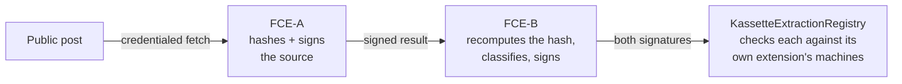
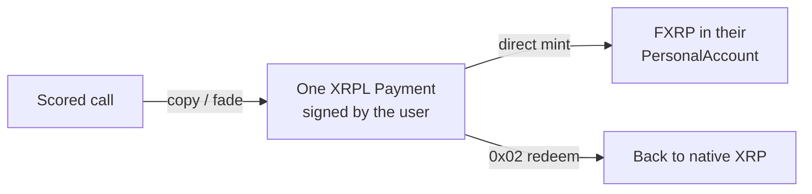

<p align="center">
  <picture>
    <source media="(prefers-color-scheme: dark)" srcset="web/public/kassette-lockup-inverse.svg">
    
  </picture>
</p>

<p align="center"><b>A public, verifiable track record for crypto callers — every call attested inside a TEE, priced against FTSO, and tradeable as FXRP from an XRPL wallet.</b></p>

<p align="center">Bounty 1 — Interoperable Asset Products · Coston2 (chain 114)</p>

---

**Short product description:**
Kassette turns a crypto influencer's public calls into a **scored, tamper-evident record**. Each post is fetched and signed **inside a Flare Compute Extension**, a second enclave classifies it into a structured signal and refuses to touch anything the first didn't attest, and the chain checks both signatures against their own registered TEE machines. Every call is then priced against **Merkle-proven FTSO anchor feeds**, producing an equity curve against simply holding XRP. Following or fading a caller is an **FXRP position change authorised by one XRPL Payment** — no bridge, no FLR, no standing delegation.

**Target user:**
- **Followers** — want to copy callers with a proven record, without holding raw XRP or touching an EVM wallet.
- **Callers** — good ones have no way to prove it; a public record they can point to is the asset.
- **Skeptics** — want to fade a bad record, or just want the leaderboard to exist so loud-but-wrong stops being the default source of truth.

## The problem

Crypto callers post hundreds of calls a week. **Losing calls get deleted. Winning calls get screenshotted forever.** There is no shared, tamper-resistant record of whether following anyone ever made money, and no way to check whether a caller's public "accumulate" matches what their own wallet did.

This punishes the callers who are genuinely good — they have no way to prove it — and leaves everyone else filtering signal from noise by follower count.

## Our solution

Three things, tied together, and the third is what makes it a Bounty 1 product rather than a dashboard:

1. **A record that can't be quietly edited.** The post is fetched and hashed **inside an enclave**; deleting it later changes nothing, because the call still counts in the P&L and is flagged.
2. **A score against real prices.** Every call is marked against FTSO anchor feeds at its own timestamp, stored **with the Merkle proof**, so the number can prove itself on-chain rather than being asserted by our database.
3. **A verdict you can act on.** Copy or fade moves **FXRP** — the asset the follower already holds — authorised by a single XRPL Payment they sign in the moment.

### The chained-attestation flow



> FCE-B refuses to classify text FCE-A never attested. It cannot know whether FCE-A's signer is *registered* — that fact only exists on-chain — so it echoes the address it recovered, and the chain decides.

### The follower's loop



> There is no standing authority to grant or revoke: the Payment signature *is* the authorisation, per call.

---

## Why Bounty 1 — the delete-Flare test

Strip Flare out and ask what's left. If the answer is "a scraper, an LLM, a Postgres table and a dashboard", the concept doesn't deserve an integration score. This build is designed so it isn't:

| Primitive | Role in Kassette | What breaks without it |
|---|---|---|
| **FCC / TEE extensions** | Two chained enclaves attest the post and its extraction; the chain verifies both | The record becomes "trust our database" — the exact problem the product claims to fix |
| **FTSO** | Prices every call at its own timestamp, stored with its Merkle proof | Scoring depends on an external price API — a claim, not a verifiable calculation |
| **FXRP / FAssets** | The asset actually moved when a follower copies or fades | "Copy the call" routes through a bridge or CEX; the product stops being a reason to hold FXRP |
| **Smart Accounts** | An XRPL user acts on Flare without bridging or holding FLR | A copy-trading app that happens to be deployed on an EVM chain, indistinguishable from one on Base |

The follower's core action — copy or fade — **is** an asset-movement decision: increase or decrease XRP-denominated exposure based on a scored, attested signal. The leaderboard is the discovery layer; the FXRP position change is the interoperable-asset product.

---

## Live on Coston2 — and what isn't

Unlike the rest of this README's genre, this section is split. A product about receipts should not overclaim its own.

### Verified on-chain

| Step | What actually happens | Primitive | Proof |
|---|---|---|---|
| **Attest a post** | a real `FETCH_POST` instruction produced a 192-byte TEE-signed attestation; the registry recovered the signer, confirmed it an **active machine of extension 66172**, and stored it against its `callId` | FCC (FCE-A) | [`0x1e4f1967…`](https://coston2-explorer.flare.network/tx/0x1e4f1967115a7a51f8da257d94a413d86020c19d530e45ee7ae9e8e5155bc6f6) · block 33976635 |
| **Reject a forgery** | a genuine FCE-B extraction whose *source* half was signed by a throwaway key — the enclave signed it and could not have known better; the registry reverted `SourceSignerNotActiveTee` | FCC (FCE-B) + registry | `contracts/scripts/verifyChainRejection.ts` |
| **Price a call** | a 30-day-old entry mark and a current mark, both Merkle-proven and accepted by live `FtsoV2.verifyFeedData`, yielding a −4.91% return with every input proven | FTSO anchor feeds | `KassetteMarkRegistry` (below) |
| **Prove determinism** | the same post produced `contentHash` `0xec1881db…24d0` across a rebuild, a new TEE machine and a port change | FCC | recorded in `claude-docs/MEMORY.md` |
| **Resolve the asset rails** | `MasterAccountController`, `AssetManagerFXRP`, Core Vault XRPL address, operator wallet and the live lot size, all read through `FlareContractRegistry` | Smart Accounts + FAssets | `GET /api/smart-account?xrpl=…` |

**Replay protection is real, not asserted.** Re-submitting the genuine attestation reverts `AlreadyAttested(callId)`; mutating the `callId` inside the signed bytes reverts `SignerNotActiveTee`, because the mutation changes the hash and recovery lands on a garbage address.

### ⚠️ Not built yet

| Gap | State |
|---|---|
| **A signed XRPL Payment** | The instruction encoding, the chain reads and the ticket are built and unit-tested. **No Payment has ever been signed or broadcast**, so no FXRP has moved. Needs an XRPL testnet account. |
| **The direct-minting fee** | Derived from the three live fee getters and the documented formula, never confirmed by a real mint — so the UI shows a *breakdown to check*, not a number to trust. |
| **The positive chain** | The registry is proven to *reject* a forgery. A genuine FCE-A → FCE-B → accept has not been run end to end. |
| **FDC** | Not started, and possibly not applicable: `Web2Json` submits its whole request on-chain including headers, so it cannot attest a credentialed endpoint — which is precisely why FCE-A exists. |
| **Wallet contradictions** | Detection logic and schema are done and tested; there is no sync script, and `data/influencer-wallets.json` is **deliberately empty**. |
| **Callers** | Fictional demo data. See below. |

### Contracts

| Contract | Address |
|---|---|
| KassetteMarkRegistry (FTSO marks + Merkle proofs) | [`0xd98cE3D6740e26Bb448c1619dD21ABd6cDE410BE`](https://coston2-explorer.flare.network/address/0xd98cE3D6740e26Bb448c1619dD21ABd6cDE410BE) |
| KassetteAttestationRegistry (FCE-A source attestation) | [`0x0244b8cA354b3129d9E44d940771409ef3c7dCd2`](https://coston2-explorer.flare.network/address/0x0244b8cA354b3129d9E44d940771409ef3c7dCd2) |
| KassetteExtractionRegistry (both TEE signatures) | [`0xA2638b8C7aF8D95a3c01fDD3896590306b141BA4`](https://coston2-explorer.flare.network/address/0xA2638b8C7aF8D95a3c01fDD3896590306b141BA4) |
| InstructionSender — FCE-A (`KASSETTE_SOURCE` / `FETCH_POST`) | [`0xe8967ae0D0F5f5e989D8ceB6e70b0C802398AfF7`](https://coston2-explorer.flare.network/address/0xe8967ae0D0F5f5e989D8ceB6e70b0C802398AfF7) |
| InstructionSender — FCE-B (`KASSETTE_EXTRACT` / `EXTRACT_SIGNAL`) | [`0x876eb4207ebe7aE0F681447b7C7e0A1053b647Eb`](https://coston2-explorer.flare.network/address/0x876eb4207ebe7aE0F681447b7C7e0A1053b647Eb) |

TEE extension ids **66172** (source) and **66213** (extraction).

⚠️ **TEE machine addresses are deliberately absent.** The enclave signing key lives in memory, so every container restart mints a new machine. Nothing hardcodes one — the registries resolve them through `getActiveTeeMachines` at submit time, which is exactly what makes a stale machine's key unable to backfill history.

Externals resolved through `FlareContractRegistry`, never hardcoded: **FtsoV2**, **MasterAccountController** `0x434936d4…`, **AssetManagerFXRP** `0xc1Ca88b9…`, **FXRP** `0x0b6A3645…`.

---

## Flare primitives — each does load-bearing work

| Primitive | Role in Kassette |
|---|---|
| **FCC / TEE extensions** | Two of them. FCE-A holds the platform credential and attests the post; FCE-B holds the model credential, recomputes the content hash, and refuses to classify anything unattested. Separate credentials, separate extension ids, separate registered machines. |
| **FTSO** | Every call marked at its own timestamp via DA Layer anchor feeds — stored with the proof, verifiable a year back. |
| **FXRP / FAssets** | The settlement leg. Copy direct-mints into the follower's PersonalAccount; fade is a `0x02` redemption in whole lots, rounded against the **live** lot size. |
| **Smart Accounts** | `getPersonalAccount` / `getNonce` read live; the position change is authorised by one XRPL Payment, so there is no standing authority to revoke. |

## The split that shapes the design

The docs originally specified that FCE-B should verify FCE-A's signature *inside the enclave*. **Half of that is impossible**, and finding out why changed the architecture:

An FCC extension has no chain access. It can `ecrecover` FCE-A's signer, but it cannot know whether that address is a **live machine of FCE-A's extension** — that fact exists only in on-chain state, and handing the enclave an RPC client doesn't fix it (the answer arrives unauthenticated). So the check is split, each half done where the evidence actually is:

| Claim | Established by |
|---|---|
| the classified text is the attested text | FCE-B in-enclave — recomputes the content hash, refuses on mismatch |
| FCE-A's signer is a registered machine | the registry, via `getActiveTeeMachines` |
| FCE-B's signer is a registered machine | the registry, against a **different** extension id |
| both halves concern the same call and post | the registry, `callId` + `contentHash` equality |

The bridge is that **FCE-B echoes the address it recovered into its own signed output**. Drop that field and the chain becomes forgeable off-chain: an attacker signs a fake source attestation with a throwaway key over text they wrote, FCE-B finds it perfectly self-consistent, and the result is TEE-signed with nothing left to contradict it. A test pins exactly this — the enclave *accepts* the forgery on purpose and reports the forger's address, and the contract rejects it.

## Scoring — deterministic, with the model outside the trust path

```
pnl        = $1,000 notional per call, entry at the attested timestamp
benchmark  = the same money held in XRP over the same window
verdict    = plain arithmetic over FTSO anchor feeds — no model involved
```

An LLM turns raw post text into `{asset, direction, target, confidence}`, and that is the **only** non-deterministic step. It is kept out of the trust path by construction: the extraction is rendered **beside the source post** so it can be checked by eye, and the equity-curve arithmetic never consults it. Confidence below the bar files the call as `AMBIGUOUS` — shown, never scored.

---

## Run it

The web app needs **no keys**. It reads a local SQLite file seeded from live Coston2 FTSO data:

```bash
cd web
npm install
npm run seed -- --reset     # prices ~10 calls against LIVE anchor feeds
npm run dev                 # → http://localhost:3000
```

⚠️ The DA Layer is rate-limited without an API key and the seed reliably trips it partway through, deleting the database before it fails. Retry in a loop:

```bash
for i in 1 2 3 4 5 6; do rm -f kassette.db; npm run seed -- --reset && break; sleep 75; done
```

Checks:

```bash
npm test        # 88 unit tests
npm run e2e     # 37 browser checks (dev server must be running)
npm run typecheck && npm run build && npm run lint
```

---

## Honest disclosures

- **`SIMULATED_TEE=true` on Coston2.** The routing, signing, registration and on-chain verification are all real. The hardware attestation is not — and it is worse than "stubbed": FCE-B registered with a code hash **byte-identical to FCE-A's**, from a completely different image. So under MODE=1 the code hash distinguishes nothing. What genuinely separates the two enclaves is on-chain and real: distinct extension ids, distinct registered machines with distinct keys, and a registry checking each signature against its own extension's active set. **Separation by identity, not by measurement.**
- **The source is one hop weaker than X itself.** X's own API keeps tweet lookup behind a paid tier, so FCE-A fetches through a third-party aggregator. The attestation says "this credentialed provider returned this post", not "X's servers did". The credential still never leaves the enclave and the endpoint is pinned in the attested build.
- **The pinned model is a name, not weights.** The provider routes a model id to one of several upstream hosts; the code hash pins the *name*, prompt and tool schema, not what answered. Which is why the result echoes `modelHash` explicitly rather than leaving it implied.
- **Callers are fictional.** Attribution is **self-disclosed only** — no OSINT, no clustering, no "we're pretty sure this is theirs". Publicly asserting that a named person's wallet contradicts them is a strong, falsifiable claim, and getting it wrong via inference turns a data bug into a reputational one. Every entry needs a human-verified disclosure URL, so the real list is empty and the demo uses invented callers.
- **No standing delegation, anywhere.** Not a scope cut — a design constraint. The UI has no "enable auto-trading", the allocations page saves a **local prefill that authorises nothing**, and the portfolio reports no realized P&L because nothing in the schema records what a position was later worth. Empty states say *nothing was checked* rather than *nothing was found*.

---

## Roadmap

- **Sign one real Payment** — an XRPL testnet account, one direct mint, and the derived fee formula becomes a confirmed one.
- **The positive chain end to end** — a genuine FCE-A attestation feeding FCE-B and being *accepted* by the registry, not just a forgery being rejected.
- **Caller verification** — prove wallet ownership with a signed message, which expands the caller set without ever crossing into OSINT inference.
- **The structured call as a public good** — once attested and priced, a call is a reusable Flare-native data object. A bot, a Discord alert or a wallet extension could consume it without touching this frontend at all.

## Maintenance

Repo: [github.com/xavio2495/Kassette](https://github.com/xavio2495/Kassette)

This build exists to demonstrate a bar, not to claim traction. What carries forward is specific and checkable: the schema outlives the frontend, and the two things gating a bigger caller set and full automation are **named**, not hidden.

## License

[MIT](LICENSE) © 2026 Kassette
