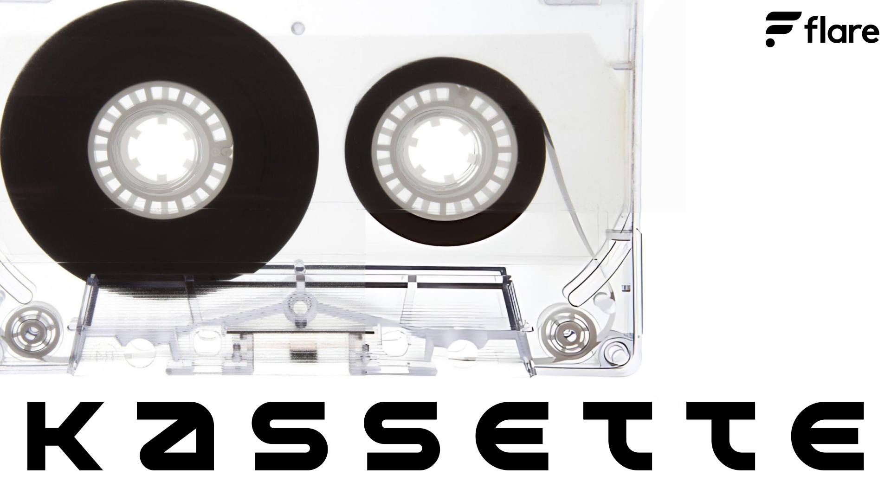
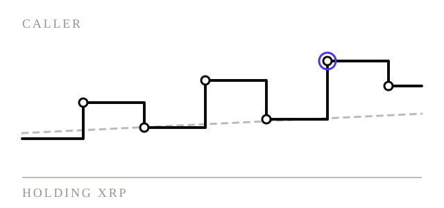
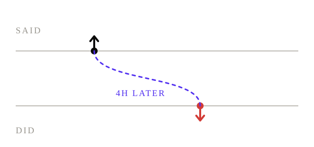
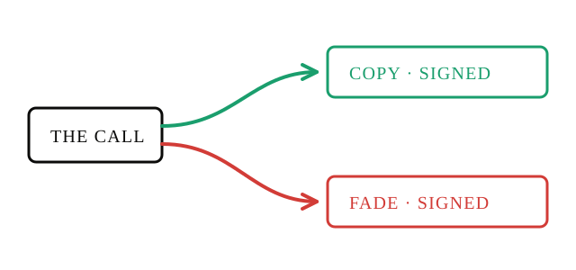
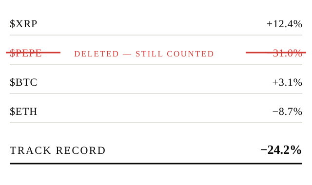
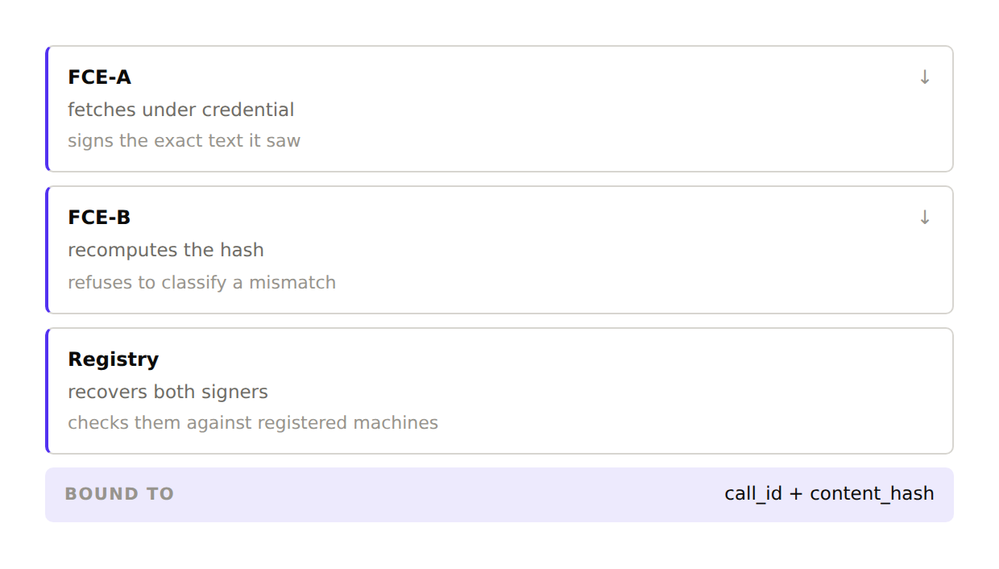
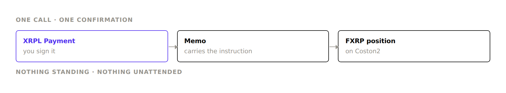
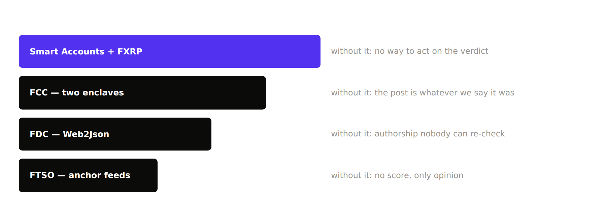
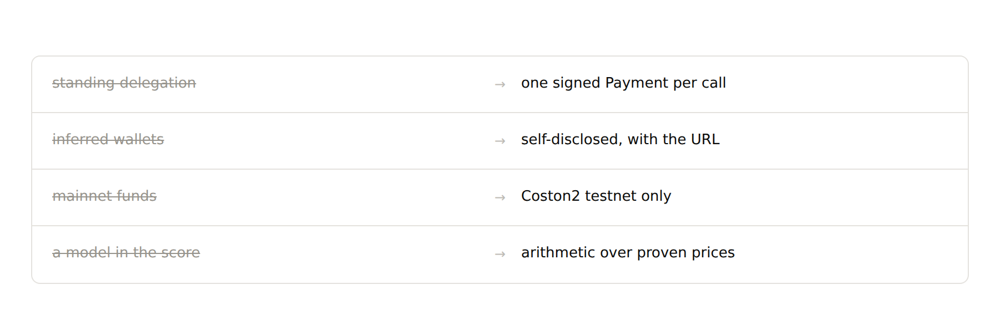

<p align="center">
  
</p>

<h1 align="center">Kassette</h1>

<p align="center">
  A public, verifiable track record for crypto callers — every post attested inside a TEE,<br>
  priced against FTSO, and tradeable as FXRP from an XRPL wallet.
</p>

<p align="center">
  <a href="https://kassette-gamma.vercel.app"><b>Live demo</b></a> ·
  <a href="https://kassette-gamma.vercel.app/pitch">the argument</a> ·
  <a href="https://kassette-gamma.vercel.app/terminal">the terminal</a> ·
  <a href="https://kassette-gamma.vercel.app/leaderboard">the leaderboard</a>
</p>

<p align="center">
  <b>Live on Coston2</b><br>
  extraction registry <a href="https://coston2-explorer.flare.network/address/0xA2638b8C7aF8D95a3c01fDD3896590306b141BA4"><code>0xA2638b8C7aF8D95a3c01fDD3896590306b141BA4</code></a><br>
  execution registry <a href="https://coston2-explorer.flare.network/address/0xA547dD80a28Dc59A6b555A5E4aCc06B9856Aa6e6"><code>0xA547dD80a28Dc59A6b555A5E4aCc06B9856Aa6e6</code></a>
</p>

> **Testnet only.** No mainnet deployment, no production keys, no real funds. The asset is
> Coston2's test FAsset (`FTestXRP`), not mainnet FXRP.

---

## Contents

- [The idea](#the-idea)
- [What is built](#what-is-built)
  - [The two enclaves, and what their separation does and does not prove](#the-two-enclaves-and-what-their-separation-does-and-does-not-prove)
  - [Two attestations, two different claims](#two-attestations-two-different-claims)
  - [The follower's path](#the-followers-path)
- [Why this fits the track](#why-this-fits-the-track)
- [Design decisions worth knowing](#design-decisions-worth-knowing)
- [Proof — measured, not asserted](#proof--measured-not-asserted)
- [Deployed contracts](#deployed-contracts)
- [Repository layout](#repository-layout)
- [Running it](#running-it)
- [Honest scope](#honest-scope)
- [Licence](#licence)

---

## The idea

A caller posts *"XRP is going to $5."* Two hundred thousand people see it. It doesn't happen —
and the post quietly disappears. The next thread only shows the wins.

That works because nobody keeps the tape. Kassette keeps the tape.



Every call is marked against Flare's own price feeds **at the timestamp it was posted**, and
every mark is stored with the Merkle proof behind it. The output is not "did the call go up"
but the only question that matters: **did following them beat doing nothing.**

Three claims, and each one is checkable rather than asserted.

**Every call, priced.** $1,000 notional per call, entry at the attested timestamp, against
holding XRP over the same window.

**Said versus did.** The call cross-referenced against the caller's own on-chain activity in
the window that follows, cited to the transaction.



**Copy or fade.** A verdict you cannot act on is just an opinion.



And deletion doesn't help. A deleted post keeps its place in the P&L and is tallied
separately, so the record a caller can edit is not the record that scores them.



---

## What is built

### The two enclaves, and what their separation does and does not prove



**FCE-A** fetches the post using a platform credential and signs a hash of exactly the text it
saw. That credential never leaves the enclave — which is *why* it is an enclave, and the hard
technical reason this cannot be an FDC attestation instead (see below).

**FCE-B** takes that signed attestation, recomputes the content hash over the text it is about
to classify, and **refuses to sign on mismatch**. Then it echoes back the signer address it
recovered.

That echoed field is the whole design. The docs originally specified that FCE-B should verify
FCE-A's signature *inside the enclave* — and **half of that is impossible**. An extension has
no chain access. It can `ecrecover` a signer, but it cannot know whether that address is a
**live machine of FCE-A's extension**; that fact exists only in on-chain state, and handing the
enclave an RPC client doesn't fix it, because the answer would arrive unauthenticated and the
URL would join the attested build for nothing.

So the check is split, each half done where the evidence actually is:

| Claim | Established by |
|---|---|
| the classified text is the attested text | **FCE-B, in-enclave** — recomputes the content hash, refuses on mismatch |
| FCE-A's signer is a registered machine | **the registry**, via `getActiveTeeMachines` |
| FCE-B's signer is a registered machine | **the registry**, against a *different* extension id |
| both halves concern the same call and post | **the registry**, `callId` + `contentHash` equality |

Drop the echoed field and the chain is forgeable off-chain: an attacker signs a fake source
attestation with a throwaway key over text they wrote, FCE-B finds it perfectly
self-consistent, and the result comes out TEE-signed with nothing left to contradict it. A
test pins exactly this — the enclave *accepts* the forgery on purpose and reports the forger's
address, and the contract rejects it with `SourceSignerNotActiveTee`.

### Two attestations, two different claims

A call can carry either, both, or neither, and the UI reports them separately because one
badge cannot speak for two claims.

| | **FDC — `Web2Json`** | **FCE-A + FCE-B** |
|---|---|---|
| attests | **authorship** — this post id belongs to this account | the post's **text**, and its classification |
| source | `publish.x.com/oembed`, credential-free | a credentialed provider, inside the enclave |
| who can re-check it | **anyone**, without trusting Kassette | anyone, against the registered machines |
| verified by | `verifyWeb2Json` on-chain | `KassetteExtractionRegistry`, both signatures |

They are complementary, not redundant, and the split is forced rather than chosen. A
`Web2Json` request is submitted on-chain **headers included** and echoed back in the response,
so any API key in it is public. FDC can therefore only attest endpoints needing no credential
— which is exactly why the credentialed text fetch has to happen inside a TEE.

### The follower's path



An XRPL holder acts on Flare by signing **one XRPL Payment**. No bridge, no FLR for gas, no
second wallet. The memo carries the Custom Instruction (`0xFF`) with the entire EIP-4337
`PackedUserOperation` inline, so no executor service sits in the middle:

```
memo = [ 0xFF | walletId(1B)=248 | executorFeeUBA(8B) | abi.encode(PackedUserOperation) ]
```

The mint and the `KassetteExecutionRegistry.record` land in **one atomic Flare transaction**,
with the position bound to the call id that motivated it — so a plan signed for one call
cannot be replayed onto another.

**The signature on that Payment is the authorisation.** Which is exactly why there is nothing
standing to revoke: no delegation, no approval sitting on a contract, no service holding keys
and trading unattended.

---

## Why this fits the track



Built for **Interoperable Asset Products**. The test a primitive should pass is not *"did we
use it"* but *"what breaks without it"* — a primitive that can be removed with no consequence
was decoration. Strip Flare out of Kassette and ask what's left; if the answer is "a scraper,
an LLM, a Postgres table and a dashboard", the concept doesn't deserve an integration score.

| Primitive | Role | What breaks without it |
|---|---|---|
| **FCC** — two chained enclaves | attests the post and its extraction; the chain verifies both | the record becomes "trust our database" — the exact problem the product claims to fix |
| **FTSO** — anchor feeds | prices every call at its own timestamp, stored with its Merkle proof | scoring depends on an external price API: a claim, not a verifiable calculation |
| **FDC** — `Web2Json` | authorship, from an endpoint anyone can re-check | the only evidence is evidence you have to trust us for |
| **FAssets / FXRP** | the asset that actually moves on copy or fade | "copy the call" routes through a bridge or a CEX, and the product stops being a reason to hold FXRP |
| **Smart Accounts** | an XRPL user acts on Flare without bridging or holding FLR | a copy-trading app that happens to be on an EVM chain, indistinguishable from one on Base |

The follower's core action — copy or fade — **is** an asset-movement decision: increase or
decrease XRP-denominated exposure based on a scored, attested signal. The leaderboard is the
discovery layer; the FXRP position change is the interoperable-asset product.

---

## Design decisions worth knowing

**The scoring math has no model in it.** An LLM turns raw post text into
`{asset, direction, target, confidence}` and that is the *only* non-deterministic step. It is
kept out of the trust path by construction — the extraction is rendered **beside the source
post** so it can be checked by eye, and the equity-curve arithmetic never consults it:

```
pnl        = $1,000 notional per call, entry at the attested timestamp
benchmark  = the same money held in XRP over the same window
verdict    = plain arithmetic over FTSO anchor feeds — no model involved
```

**The publish bar is 0.85, and it was not lowered to populate the demo.** Nine calls sat at
exactly 0.80. Dropping the threshold five points would have converted all nine and made the
leaderboard look considerably better — but six of them were a greeting (*"GM 😊 XRP
MILLIONAIRES! Have a blessed saturday.."*), a platitude about the price of coffee, and news
about somebody *else's* trade. Scoring those would have put invented P&L on real, named
people. The caller set was changed instead. `web/data/callers.json` records which candidates
were rejected and why.

**Wallet attribution is self-disclosed only.** No OSINT, no clustering, no "we're pretty sure
this is theirs". Publicly asserting that a named person's wallet contradicts them is a strong,
falsifiable claim, and getting it wrong by inference turns a data bug into a reputational one.
Every entry needs a `disclosure_source_url`; without one, said-vs-did reports *"no wallet
disclosed"* rather than guessing.

**Every attested artifact carries the call id it was produced for.** Both enclave results echo
`call_id` and `content_hash`, and the registry checks they agree — so a grade signed for one
call cannot be replayed onto another.

**Prompt injection is assumed, not hoped against.** The extraction LLM parses hostile input by
design: a post is externally-provided content, and something extracted in-enclave and
TEE-signed comes out *more* trusted, not less. The containment is the closed tool-call schema
— enum and bounded-numeric output only — and nothing extracted ever becomes an instruction.

**No standing delegation, anywhere.** Not a scope cut, a design constraint. There is no
"enable auto-trading", the allocations page saves a local prefill that authorises nothing, and
empty states say *nothing was checked* rather than *nothing was found*.

---

## Proof — measured, not asserted

| What it shows | Evidence |
|---|---|
| A real `FETCH_POST` produced a 192-byte TEE-signed attestation; the registry recovered the signer, confirmed it an active machine of extension **66172**, and stored it | [`0x1e4f1967…`](https://coston2-explorer.flare.network/tx/0x1e4f1967115a7a51f8da257d94a413d86020c19d530e45ee7ae9e8e5155bc6f6) |
| **The positive chain** — a genuine FCE-A attestation handed to FCE-B and *accepted* by the registry, both signatures against different extensions. Six calls carry it | [`0x2640f787…`](https://coston2-explorer.flare.network/tx/0x2640f7877dd7ca6669f7f185e050c1849189b5e6b4c574826f33ffe2fadf2e2e) |
| **A forgery rejected** — a genuine FCE-B extraction whose *source* half was signed by a throwaway key. The enclave signed it and could not have known better; the registry reverted `SourceSignerNotActiveTee` | `contracts/scripts/verifyChainRejection.ts` |
| **FDC `Web2Json` verified on-chain** — `verifyWeb2Json` returned `true` for six posts, voting rounds 1426568–1426575 | [`0xf35bce38…`](https://coston2-explorer.flare.network/tx/0xf35bce38d8603161af7e7cb30c8e8304e9266689cada7dccb59b410928ed8afe) |
| **A full FXRP round trip from an XRPL wallet** — 100 XRP in, 99.749 XRP out. Mint `22B70E48…24FE`, redeem `3C48EC58…06AE`. The direct-minting fee formula predicted 10,200,000 drops for one lot and exactly 10.000000 FXRP arrived | XRPL testnet `r3eQYJu…zq1T` → personal account `0xBC849A6B…236f` |
| **Determinism across rebuilds** — the same post produced `contentHash` `0xec1881db…24d0` across a rebuild, a new TEE machine and a port change | `claude-docs/MEMORY.md` |

**Replay protection is a revert, not a claim.** Re-submitting a genuine attestation reverts
`AlreadyAttested(callId)`; mutating the `callId` inside the signed bytes reverts
`SignerNotActiveTee`, because the mutation changes the hash and recovery lands on a garbage
address.

**FTSO history is not the 14 days the docs imply.** Measured against Coston2's DA Layer,
XRP/USD returns a value and a valid proof at **365 days** back, and live `verifyFeedData`
accepted every one. So `lib/ftso.ts` never pre-rejects a mark on age.

---

## Deployed contracts

All on **Coston2** (chain ID **114**). Explorer: `coston2-explorer.flare.network`.

| Contract | Address |
|---|---|
| `KassetteMarkRegistry` — FTSO marks + Merkle proofs | [`0xd98cE3D6740e26Bb448c1619dD21ABd6cDE410BE`](https://coston2-explorer.flare.network/address/0xd98cE3D6740e26Bb448c1619dD21ABd6cDE410BE) |
| `KassetteAttestationRegistry` — FCE-A source attestation | [`0x0244b8cA354b3129d9E44d940771409ef3c7dCd2`](https://coston2-explorer.flare.network/address/0x0244b8cA354b3129d9E44d940771409ef3c7dCd2) |
| `KassetteExtractionRegistry` — both TEE signatures | [`0xA2638b8C7aF8D95a3c01fDD3896590306b141BA4`](https://coston2-explorer.flare.network/address/0xA2638b8C7aF8D95a3c01fDD3896590306b141BA4) |
| `KassetteExecutionRegistry` — the position, bound to its call | [`0xA547dD80a28Dc59A6b555A5E4aCc06B9856Aa6e6`](https://coston2-explorer.flare.network/address/0xA547dD80a28Dc59A6b555A5E4aCc06B9856Aa6e6) |
| `InstructionSender` — FCE-A, extension **66172** | [`0xe8967ae0D0F5f5e989D8ceB6e70b0C802398AfF7`](https://coston2-explorer.flare.network/address/0xe8967ae0D0F5f5e989D8ceB6e70b0C802398AfF7) |
| `InstructionSender` — FCE-B, extension **66213** | [`0x876eb4207ebe7aE0F681447b7C7e0A1053b647Eb`](https://coston2-explorer.flare.network/address/0x876eb4207ebe7aE0F681447b7C7e0A1053b647Eb) |

⚠️ **TEE machine addresses are deliberately absent.** The enclave signing key lives in memory,
so every container restart mints a new machine. Nothing hardcodes one — the registries resolve
them through `getActiveTeeMachines` at submit time, which is precisely what stops a stale
machine's key from backfilling history.

Everything else resolves through `FlareContractRegistry` rather than being hardcoded: `FtsoV2`,
`MasterAccountController`, `AssetManagerFXRP`, `FXRP`. The FCC system contracts are the one
documented exception — they come from `config/coston2/deployed-addresses.json` because they
are not yet registered.

---

## Repository layout

```
web/            Next.js 16 app — the desktop shell, the terminal, the deck, the API
contracts/      Hardhat — four registries, deploy and proof scripts
tee-extension/  FCE-A (fce-source) and FCE-B (fce-extract), Go
claude-docs/    Build log, error register, runbook, methodology
```

---

## Running it

The web app needs **no keys**. It reads a local SQLite file seeded from live Coston2 FTSO data:

```bash
cd web
npm install
npm run seed -- --reset     # prices calls against LIVE anchor feeds
npm run dev                 # → http://localhost:3000
```

⚠️ The DA Layer is rate-limited without an API key and the seed can trip it partway through.
Retry in a loop:

```bash
for i in 1 2 3 4 5 6; do rm -f kassette.db; npm run seed -- --reset && break; sleep 75; done
```

Checks:

```bash
npm test          # 118 unit tests
npm run e2e       # 59 browser checks
npm run build && npm run lint
cd ../contracts && npx hardhat test   # 70 Solidity tests
```

Regenerating the figures in this README, after changing `components/Diagrams.tsx`:

```bash
npm run build && npm run figures      # → web/public/figures/
```

---

## Honest scope

Stated up front rather than waiting to be asked.



- **The stack runs `SIMULATED_TEE`.** Routing, signing, registration and on-chain verification
  are all real — instructions genuinely travel on-chain to Flare's data providers and back.
  The hardware attestation is not, and it is worse than "stubbed": FCE-B registered with a code
  hash **byte-identical to FCE-A's**, from a completely different image. So under `MODE=1` the
  code hash distinguishes nothing. What genuinely separates the two enclaves is on-chain and
  real — distinct extension ids, distinct registered machines with distinct keys, and a
  registry checking each signature against its own extension's active set. **Separation by
  identity, not by measurement.** A signature proves the code *ran*; it never proves the model
  was *right*.
- **The source is one hop weaker than X itself.** X's API keeps tweet lookup behind a paid
  tier, so FCE-A fetches through a third-party aggregator. The attestation says "this
  credentialed provider returned this post", not "X's servers did". The credential still never
  leaves the enclave and the endpoint is pinned in the attested build.
- **The pinned model is a name, not weights.** The provider routes a model id to one of several
  upstream hosts; the code hash pins the *name*, prompt and tool schema, not what answered.
  Which is why the result echoes `modelHash` explicitly rather than leaving it implied.
- **Nothing has settled yet.** The scored calls are days old against 7–30 day expiry windows,
  so they are open positions with unrealized P&L. The benchmark comparison holds either way.
- **No caller has disclosed a wallet.** `data/influencer-wallets.json` is deliberately empty,
  so said-vs-did runs on seeded data — labelled as such wherever it appears.
- **The deployment's writes are not durable.** A serverless filesystem is read-only except
  `/tmp`, so the committed snapshot is copied there on cold start: reads work, writes last one
  instance. Anything needing durable writes needs a hosted database.
- **Testnet only.** No mainnet, no real funds, no claim of audit-readiness.

---

## Licence

[GNU General Public License v3.0](LICENSE) © 2026 Kassette
